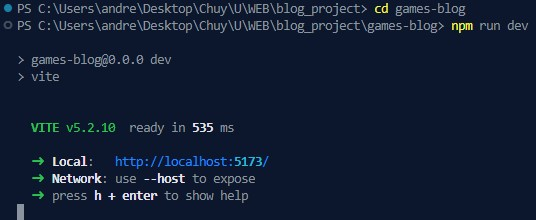

# LAB6_SERVER_SIDE_JS
The general theme of this project is to crate a web app by making both frontend and backend, for a blog about a topic of interest. In my case I decided to make it about my favorite games and im creating my own API for managing HTTP requests that can create, read, update and delete data into a DataBase with Node Js, Express and Docker. For the frontend I worked with vite, React and CSS (without any additional frameworks).

## About the author
Hi my name is Ricardo Chuy, I'm from Guatemala and I'm Currently studying Computer Science. I really like creating stuff and participating in new activities to always keep learning. If you are reading this, thank you very much for your interest and I hope this project helps you improve your skills and knowledge about programming.

## How it works
To put it as simple as possible, I broke down the functionallity of the project into steps:

1. A mysql database is configured with 1 table to store games/posts in a file called schema.sql
2. The backend is constituted by 3 files (conn.js, db.js, main.js)
3. conn.js is in charge of the connection to the db
4. db.js uses the connection to the db to make queries via async functions
5. main.js uses express to configure an API. It also uses the functions in db.js to communicate with the database
6. The docker-compose.yml is In charge of the configuration of the project. 
7. It starts up the creation of the db (using the schem.sql), the connection to the DB and the initialization of the express API
8. Now the express program serves as an API and is ready for connections
9. To consume the API I have a file called postController.jsx
10. On the controller I use async functions for each endpoint to fetch data and provide it to the front End
11. For the Front end I use React and CSS. Separating files via their functionality. 

## Technologies used
* Vite
    - React
    - JavaScript
* Docker
  - Docker Compose
* Node JS
* Express
* MySql
* JSON
* NPM
* HTML
* CSS

## Usage 
Running this project is fairly simple. The only requirements are to have Node.js installed and also Docker in your computer, in order to lift the containers with the configuration I made with docker compose. Once you have installed them, have cloned the repository and opened the project folder, you only have to run the following commands:

Ther first and **Most important thing** is to change the names of the files **.env.EXAMPLE** and **docker-compose.EXAMPLE.yml** to .env and docker-compose.yml. Also, you will need to manually add a string to the .env file. 

Move to the games-blog directory
```
cd games-blog
```

Do this download to be able to test with npm and vite after
```
npm install
```

```
docker compose up --build
```

or

```
docker compose up --build -d
```
If you don't want your command line to be taken.

After that you need to run (still in the games-blog directory)

```
npm run dev
```


Press ctrl + click while hovering the address: http://localhost:5173/, in order to be redirected to your browser so the web app is started.

And always remember to shutdown the container if you are not going to use it any longer with:
```
docker compose down
```

If you want to delete every persistent data from the container you can run:

```
docker compose down -v
```

## Endpoints
The app manages 5 different requests depending on the endpoint and the HTTP's request type. Feel free to test them with Postman, Hoppscotch, etc 

**(NOTE: port must be 12107 as definied in the dcokerfiles)**. 

These are the defined endpoints:

## Endpoints

| HTTP Method | Endpoint                              | Description                                 |
|-------------|---------------------------------------|---------------------------------------------|
| POST        | http://localhost:12107/posts           | Adds a game to the database                 |
| GET         | http://localhost:12107/posts           | Gets all the stored games on the database   |
| GET         | http://localhost:12107/posts/:postId  | Gets a post with a specific ID              |
| PUT         | http://localhost:12107/posts/:postId  | Changes properties of a specific given its ID|
| DELETE      | http://localhost:12107/posts/:postId  | Deletes a game from the database given its ID|


**Where ":postId" is the id you want to get, change or delete.** You can also try to make requests with invalid endpoints or nonexistent id's. You should be able to see different cases for error handling.

**NOTE: In order to test this, the docker container must be running without errors**

For the **POST http://localhost:12107/posts**, the body should be an "application/json", the structure is like this:

```sh
{
  "title": "A game",
  "gameDescription": "One of my favorite games",
  "genre": "Action",
  "mainPlatform": "Xbox",
  "multiplayerSupport": true,
  "onlineFeatures": false
}
```

For the **GET http://localhost:12107/posts**, there is no need for parameters in the URL nor a JSON for the body. You can just test it by setting the url and the setting the correct request type.

For the **GET http://localhost:12107/posts/:postId**, there is no need of a JSON for the body, but in this case we do need to use parameters in the url. 

For example if you want to get the post with the ID = 1, you can test it with: http://localhost:12107/posts/1. 

**Note: The post most exist otherwise an error will occur telling that the post does not exist**

For the **PUT http://localhost:12107/posts/:postId** request (change data on an existing register on the Data Base) the body should be an "application/json" and the URL must include a postID. 

Like this for example: http://localhost:12107/posts/2. Here we would be changing data from the game/post with Id = 2. 

**Note: The post most exist otherwise an error will occur telling that the post does not exist**

The values to be changed need a structure like this in the request body:

```sh
{
  "title": "A game",
  "gameDescription": "Really great game",
  "genre": "Platformer",
  "mainPlatform": "Xbox",
  "multiplayerSupport": true,
  "onlineFeatures": true
}
```

For the **DELETE http://localhost:12107/posts/:postId**, there is no need of a JSON for the body, but in this case we do need to use parameters in the url. 

For example if you want to delete the post with the ID = 1, you can test it with: http://localhost:12107/posts/1. 

**Note: The post most exist otherwise an error will occur telling that the post does not exist**

## Commands used
There are several commands that I needed in order to make the project as I needed different downloads from npm. This are the docker files and commands that helped me with the setup and configuration. 

**CAREFUL: This is not a detailed guide of how to do this project, im just going through the general commands but some also need specific changes to the package.json**

#### Dockerfiles
Docker is in charge of making the entire development configuration, downloading all the necessary dependencies for the web app, database and starting the API after the configuration of the container is done.

* https://github.com/chuy-zip/BLOG_PROJECT/tree/main/games-blog/dockerfiles
* https://github.com/chuy-zip/BLOG_PROJECT/blob/main/games-blog/dockerfiles/app/Dockerfile
* https://github.com/chuy-zip/BLOG_PROJECT/blob/main/games-blog/dockerfiles/sql/Dockerfile
* https://github.com/chuy-zip/BLOG_PROJECT/blob/main/games-blog/docker-compose.yml

#### Install dependencies listed in the package.json (this file is created by vite)
```sh
npm install
```

#### Download of Express framework:
```sh
npm install Express
```
**DO NOT COMMIT "node_modules" EVER**

Vite already includes a gitignore so this does not happen.

#### Mysql2 to make queries to the Data Base:
```sh
npm install mysql2
```

#### Install the CORS (Cross-Origin Resource Sharing) for secure communications on API
```sh
npm install cors
```

####  Install Crypto-JS for cryptographic functions such as encryption
```sh
npm install crypto-js
```

####  Install dotenv for using environment variables
```sh
npm install dotenv
```

####  Install jsonwebtoken to use tokens for authentications and security
```sh
npm install jsonwebtoken
```

 


